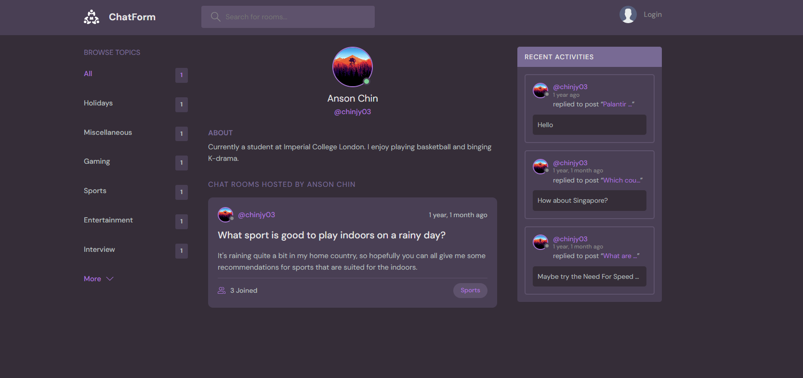
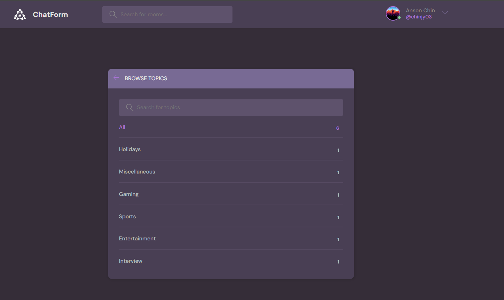
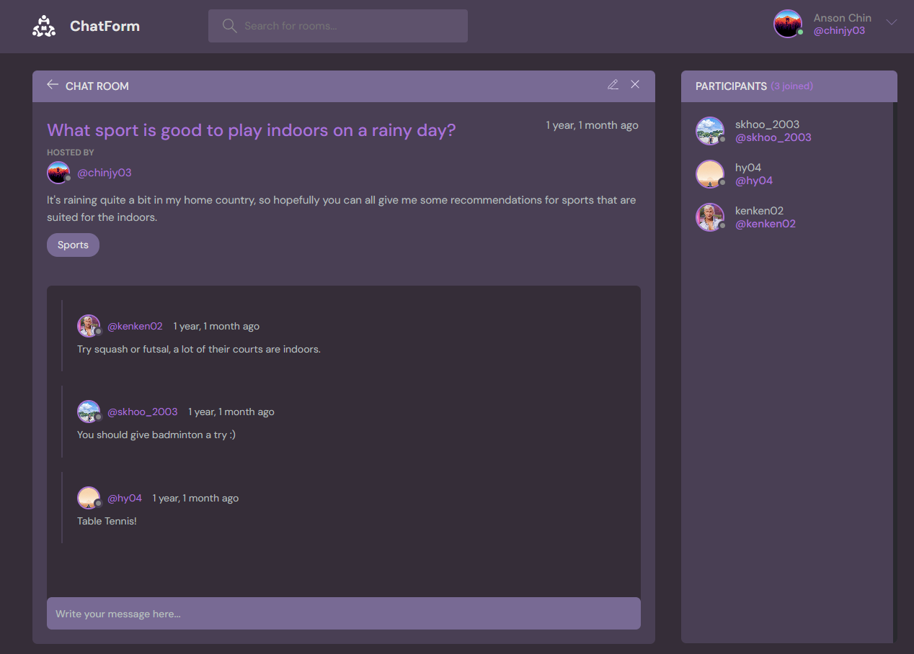
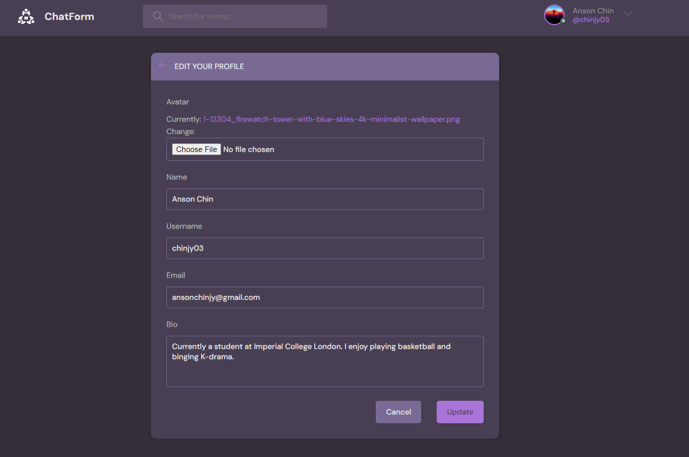

# ChatForm

ChatForm is a Django-based forum-style web application that prioritizes user experience and introduces a fresh, captivating design. This project provided an opportunity to sharpen my skills in Git, web development, and full-stack programming. ChatForm is not just about discussion—it's about community, connection, and a seamless user experience.

[View the deployed application here](http://samuelkhoo.pythonanywhere.com/)

<video width="600" controls>
  <source src="demo_assets/chatform.webm" type="video/webm">
  Your browser does not support the video tag.
</video>


## Project Overview

- **Development:** Independently developed and deployed a dynamic chat and forum platform using Django, JavaScript, and PostgreSQL/SQLite.
- **Key Features:**
  - Live room updates
  - User authentication and profile management
  - RESTful APIs for seamless data interaction
- **Design:** Utilized Figma for prototyping, translating the designs into responsive HTML and CSS implementations.


## Features

<details>
  <summary>Current Features</summary>

  - User authentication and profile management
  - Interactive activity feed
  - Responsive design
  - User model design with customizable options
  - Forum-style messaging system
  - RESTful APIs for seamless data interaction

</details>

<details>
  <summary>Planned Features</summary>

  - **Edit Message Option:** Allow users to edit their messages after posting.
  - **Room and Topic Creation:** Enable the creation of custom rooms and topics in the activity feed.
  - **Decluttering Features:** Introduce options to reduce the number of rooms and activities initially displayed, with options to expand the view.
  - **Follower System:** Implement a system where users can follow others and filter their feed to show content from individuals they follow.

</details>

## Technologies Used

- **Frontend:** HTML, CSS, JavaScript
- **Backend:** Django, Python
- **Database:** Sqlite/PostgreSQL
- **Version Control:** Git
- **Deployment:** PythonAnywhere


## A Quick Demo Of Chatform!





## Installation and Setup

<details>
  <summary>Setup Instructions</summary>

  1. Clone the repository:
     ```bash
     git clone https://github.com/SamuelKhoo2003/chatform.git
     ```
  2. Navigate to the project directory:
     ```bash
     cd chatform
     ```
  3. Install the required dependencies:
     ```bash
     pip install -r requirements.txt
     ```
  4. Run the development server:
     ```bash
     python manage.py runserver
     ```

  5. Access the application in your browser at `http://localhost:8000/`.

</details>

## Contributing

Contributions are welcome! If you'd like to contribute, please fork the repository and use a feature branch. Pull requests are warmly welcome.

1. Fork the repo
2. Create a new feature branch (`git checkout -b feature/YourFeature`)
3. Commit your changes (`git commit -m 'Add some YourFeature'`)
4. Push to the branch (`git push origin feature/YourFeature`)
5. Open a Pull Request

Please make sure your code follows the project's coding standards and passes all tests before submitting!

## Contact

Feel free to reach out to me via [LinkedIn](https://www.linkedin.com/in/samuel-khoo-b21ab1253/) or [email](samuel.khoo22@imperial.ac.uk) if you have any questions or suggestions.

---

_This project was created as part of my journey to improve my full-stack development skills._
